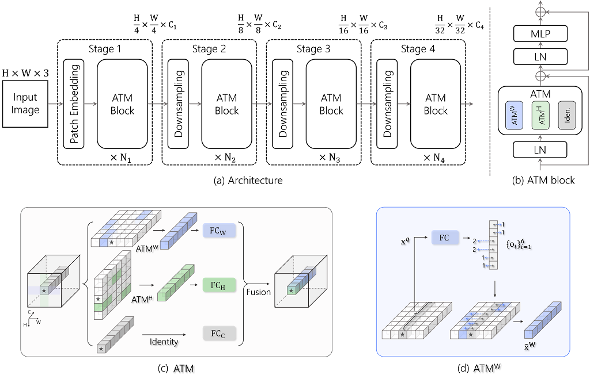

# ActiveMLP (AAAI 2023)

This repo is the official implementation of "*[ActiveMLP: An MLP-like Architecture with Active Token Mixer](https://arxiv.org/abs/2203.06108)*", by *Guoqiang Wei\*, Zhizheng Zhang\*, Cuiling Lan, Yan Lu and Zhibo Chen*.

**ActiveMLP** is a general MLP-like visual backbone, which is applicable to image classification, object detection and semantic segmentation tasks. The core operator, Active Token Mixer (`ATM`), actively incorporates contextual information from other tokens in the global scope. It adaptively predicts where to capture useful contexts and learns how to fuse the captured contexts with the origianl information at channel levels. 

The ActiveMLP variants achieve `79.7% ~ 84.8%` acc@top1 with the models scaled from `15M ~ 76M` on ImageNet-1K. It also shows the superiority on downstream dense prediction tasks. `ActiveMLP-Large` achieves `51.1% mIoU` with UperNet on ADE20K semantic segmentation dataset.  




## Image classification on ImageNet-1K

| name | size |acc@1 | #params | FLOPs | download |
|:---:|:---:|:---:| :---:| :---:|:---:|
| Active-xT | 224 $\times$ 224 | 79.7 | 15M | 2.2G | [model](https://drive.google.com/file/d/1JjWFDJM097a2sX9zw2oOisCT-7T43-DV/view?usp=sharing) / [log](https://drive.google.com/file/d/1Ppe7HlMLruQpsiZ8km4sbimkO9XIpfLV/view?usp=sharing) |
| Active-T | 224 $\times$ 224 | 82.0 | 27M | 4.0G | [model](https://drive.google.com/file/d/1eFv5SsGr6ZpupY0wB-N2mjVhQLSo92o-/view?usp=sharing) / [log](https://drive.google.com/file/d/19IJSP-TWBxvA5UJVcYVhqlYRHkkDTdVJ/view?usp=sharing) |
| Active-S | 224 $\times$ 224 | 83.1 | 39M | 6.9G | [model](https://drive.google.com/file/d/1lEsyiXxOxT6KMrzaSCxR04i6FxLtVVAs/view?usp=sharing) / [log](https://drive.google.com/file/d/1YoaOIjlb0lCRAyrTIpgeB_NWySbkTgpB/view?usp=sharing)  |
| Active-B | 224 $\times$ 224 | 83.5 | 52M | 10.1G | [model](https://drive.google.com/file/d/1cCLS1u4043qKgVIKkGJfLhPz_JzE6FRs/view?usp=sharing) |
| Active-L | 224 $\times$ 224 | 83.8 | 76M | 12.4G | [model](https://drive.google.com/file/d/1aIEnq_5-oS8jiLr2W8ryLabmzHTmR3J0/view?usp=sharing) |
| Active-L $\uparrow$ | 384 $\times$ 384 | 84.8 | 76M | 36.4G | [model](https://drive.google.com/file/d/13nrfXqc49s8kKrEKpNSltEdqMBg3f1rB/view?usp=sharing) |

## Usage

The following guideline of ActiveMLP is for image classification, the guideline for semantic segmentation can be found [here](segmentation/README.md).

### Install

- Clone this repo:
```bash
git clone https://github.com/microsoft/ActiveMLP.git
cd ActiveMLP
```
- Install `pytorch` following the [official guideline](https://pytorch.org/), we use `pytorch==1.7.1` with `cuda==11.1` and `cudnn8`.
- Install other packages with:
```bash
pip install -r requirements.txt
``` 

### Data preparation

Download the standard ImageNet-1K dataset from [http://image-net.org](http://image-net.org), and construct the data like:
```bash
ImageNet_Root
├── train
│   ├── n01440764
│   │   ├── n01440764_10026.JPEG
│   │   ├── n01440764_10027.JPEG
│   │   ├── ...
│   ├── ...
├── val
    ├── n02093754
    │   ├── ILSVRC2012_val_00000832.JPEG
    │   ├── ILSVRC2012_val_00003267.JPEG
    │   ├── ...
    ├── ...
```

### Evaluation

To evaluate a pre-trained `ActiveMLP` on ImageNet val, run with:

```bash
python -m torch.distributed.launch --nproc_per_node <num-gpus> \
    --use_env main.py \
    --data-path <path-to-imagenet> \
    --model <activemlp-model> \
    --resume <checkpoint.pth> \
    --eval --dist-eval 
```

For example, to evaluate the `ActiveMLP-Tiny` with two GPUs distributedly:

```bash
python -m torch.distributed.launch --nproc_per_node 2 \
    --use_env main.py \
    --data-path <path-to-imagenet> \
    --model ActiveTiny \
    --resume activemlp_tiny.pth \
    --eval --dist-eval 
```

This should give:
```bash
[ema] accuracy on 50000 test images: 81.990% acc@1 | 95.930% acc@5
```

### Training

To train an `ActiveMLP` on ImageNet from scratch, run with:
```bash
python -m torch.distributed.launch --nproc_per_node <num-gpus> \
    --use_env main.py \
    --batch-size <batch-szie> \
    --data-path <path-to-imagenet> \
    --model <activemlp-model> [other options]
```
For example, train the `ActiveMLP-Tiny` with `1024` batch size on 8 GPUs, run with:
```bash
python -m torch.distributed.launch --nproc_per_node 8 \ 
    --use_env main.py \
    --batch-size 128 \
    --data-path <path-to-imagenet> \
    --model ActivexTiny \
    --drop-path 0.1 \
    --output-dir active_xtiny_output
```

### Throughput

To evaluate the throughput, run with:
```bash
python -m torch.distributed.launch --nproc_per_node 1 \
    --use_env main.py --batch-size 64 \
    --data-path <path-to-imagenet> \
    --model ActivexTiny \
    --throughput
```

## Citing 

```bash
@article{wei2022activemlp,
    title={ActiveMLP: An MLP-like Architecture with Active Token Mixer},
    author={Wei, Guoqiang and Zhang, Zhizheng and Lan, Cuiling and Lu, Yan and Chen, Zhibo},
    journal={arXiv preprint arXiv:2203.06108},
    year={2022}
}
```

## Contributing

This project welcomes contributions and suggestions.  Most contributions require you to agree to a
Contributor License Agreement (CLA) declaring that you have the right to, and actually do, grant us
the rights to use your contribution. For details, visit https://cla.opensource.microsoft.com.

When you submit a pull request, a CLA bot will automatically determine whether you need to provide
a CLA and decorate the PR appropriately (e.g., status check, comment). Simply follow the instructions
provided by the bot. You will only need to do this once across all repos using our CLA.

This project has adopted the [Microsoft Open Source Code of Conduct](https://opensource.microsoft.com/codeofconduct/).
For more information see the [Code of Conduct FAQ](https://opensource.microsoft.com/codeofconduct/faq/) or
contact [opencode@microsoft.com](mailto:opencode@microsoft.com) with any additional questions or comments.

## Trademarks

This project may contain trademarks or logos for projects, products, or services. Authorized use of Microsoft 
trademarks or logos is subject to and must follow 
[Microsoft's Trademark & Brand Guidelines](https://www.microsoft.com/en-us/legal/intellectualproperty/trademarks/usage/general).
Use of Microsoft trademarks or logos in modified versions of this project must not cause confusion or imply Microsoft sponsorship.
Any use of third-party trademarks or logos are subject to those third-party's policies.
