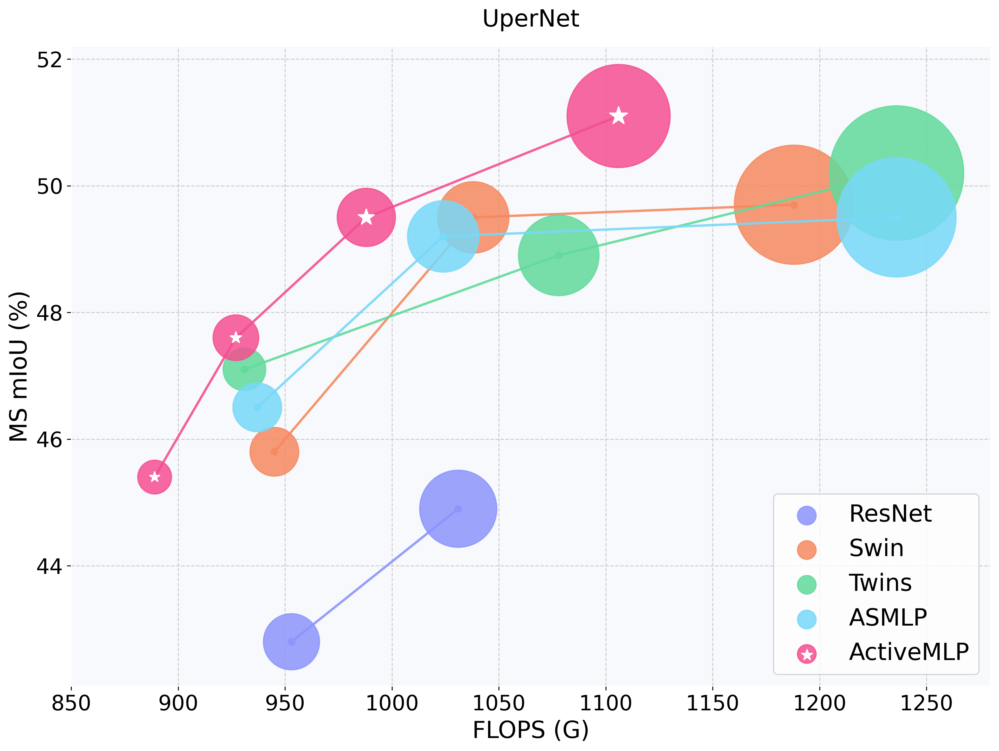

# ActiveMLP for Semantic Segmentation

This is the official impelmentation of [ActiveMLP](https://arxiv.org/abs/2203.06108) for semantic segmentation.



## Results and models

### ADE20K 

#### UperNet

| Backbone | Method | #iters | mIoU | mIoU (ms) | #params. | FLOPs (512x2048)  | model |
|:---:|:---:|:---:|:---:|:---:|:---:|:---:|:---:|
| Active-xT | UperNet | 160K | 44.27 | 45.44 | 45.3M | 889.5G |  |
| Active-T | UperNet | 160K | 46.46 | 47.55 | 57.1M | 926.9G |  |
| Active-S | UperNet | 160K | 48.42 | 49.49 | 68.6M | 988.3G |  |
| Active-B | UperNet | 160K | 48.63 | 49.86 | 82.1M | 1055.9G |  |
| Active-L | UperNet | 160K | 50.05 | **51.10** | 107.9M | 1105.6G | [model](https://drive.google.com/file/d/1vWTI7gRiI3Fd5g6UPziSyafliq3yrhrO/view?usp=sharing)/[log](https://drive.google.com/file/d/17mWkgCwxRQartOVzfe_ZiG-SwaJppISk/view?usp=sharing) |

#### Semantic FPN

| Backbone | Method | #iters | mIoU | #params. | FLOPs (512x512) | model |
|:---:|:---:|:---:|:---:|:---:|:---:|:---:|:---:|
| Active-xT | Semantic FPN | 40K | 43.03 | 19.1M | 33.1G |  |
| Active-T | Semantic FPN | 40K | 45.84 | 30.9M | 42.4G |  |
| Active-S | Semantic FPN | 40K | 47.30 | 42.4M | 57.8G |  |
| Active-B | Semantic FPN | 40K | 47.73 | 55.9M | 74.7G |  |
| Active-L | Semantic FPN | 40K | **48.05** | 79.8M | 86.6G |  |

## Usage

### Install and data preparation

- Install required packages following [ActiveMLP](../README.md).
- Install `mmcv` and `mmsegmentation` with:
```bash
pip install mmcv-full==1.3.0 mmsegmentation==0.11.0
```
- Install `Apex`:
```bash
git clone https://github.com/NVIDIA/apex
cd apex
pip install -v --disable-pip-version-check --no-cache-dir --global-option="--cpp_ext" --global-option="--cuda_ext" ./
```
- Prepare ADE20K following the [guidelines](https://github.com/open-mmlab/mmsegmentation/blob/master/docs/en/dataset_prepare.md#ade20k) in `mmsegmentation`.

### Evaluation

- To evaluate a pre-trained segmentation model, run with:

```bash
# single-scale mIoU
python -m torch.distributed.launch --nproc_per_node <num-gpus> \
    tools/test.py <config-file> <checkpoint.pth> \
    --launcher pytorch --eval mIoU

# multi-scale mIoU
python -m torch.distributed.launch --nproc_per_node <num-gpus> \
    tools/test.py <config-file> <checkpoint.pth> \
    --launcher pytorch --eval mIoU --aug-test 
```

For example, to evaluate the multi-scale mIoU of `ActiveMLP-Large+UperNet` with two GPUs distributedly:

```bash
python -m torch.distributed.launch --nproc_per_node 2 \
    tools/test.py configs/activemlp/active_large_ade20k_upernet_160k.py \
    active_large_upernet_160k.pth --launcher pytorch --eval mIoU --aug-test
```

This should give:
```bash
+--------+------+-------+-------+
| Scope  | mIoU | mAcc  | aAcc  |
+--------+------+-------+-------+
| global | 51.1 | 61.95 | 83.86 |
+--------+------+-------+-------+
```

- To get the FLOPs and parameters of `ActiveMLP-Large+UperNet`, run with:

```bash
# FLOPs with input 512x2048
python tools/get_flops.py 512 2048 --config configs/activemlp/active_large_ade20k_upernet_160k.py

# output
>>> model: ActiveLarge from with: configs/activemlp/active_large_ade20k_upernet_160k.py | shape=[512, 2048]
    FLOPs: 1105.632G
    #param: 107.892M
```

### Training

To train with pre-trained models, run with:
```bash
python -m torch.distributed.launch --nproc_per_node <num-gpus> \
    tools/train.py <config-file> \
    --launcher pytorch \
    --options model.pretrained=<checkpoint.pth> [other options]
```

For example, to train `Active-Large+UperNet` on 8 gpus, run with:
```bash
python -m torch.distributed.launch --nproc_per_node 8 \
    tools/train.py configs/activemlp/active_large_ade20k_upernet_160k.py \
    --launcher pytorch \
    --options model.pretrained=activemlp_large.pth
```

## Citing 

```bash
@article{wei2022activemlp,
    title={ActiveMLP: An MLP-like Architecture with Active Token Mixer},
    author={Wei, Guoqiang and Zhang, Zhizheng and Lan, Cuiling and Lu, Yan and Chen, Zhibo},
    journal={arXiv preprint arXiv:2203.06108},
    year={2022}
}
```
